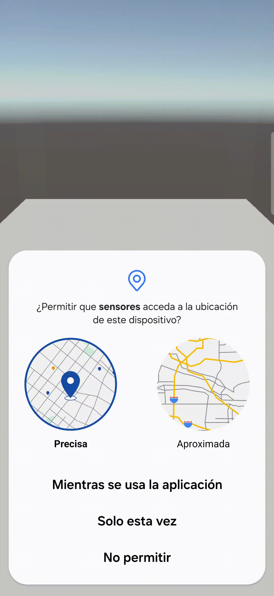

# Interfaces Inteligentes. Práctica 9. Sensores.

Este repositorio contiene los ejercicios llevados a cabo para la novena práctica de Intefaces Inteligentes.

## Ejercicios.

### Ejercicio 1.
Para la realización de este ejercicio, se ha realizado un primer [script](/scripts/IniciaSensores.cs) para iniciar los sensores. En él, se toman todos los dispositivos con los que cuenta el móvil en el que se esté ejecutando y, si son de tipo `Sensor`, los inicia.

Luego, hemos usado este otro [script](scripts/LecturaSensores.cs), en el cual se leen los datos de los sensores principales del teléfono que hemos activado y se envía la información a un gameObject `TextMeshPro` que la muestra por pantalla.

Por último, para poder pasar entre la escena del ejercicio 1 y el ejercicio 2, se ha creado este [script](scripts/CambioEscena.cs) adicional y se ha unido dicho script a un botón que dispara el método que realiza el cambio.

A continuación se muestran los resultados de obtenidos de las mediciones dentro del laboratorio y en los jardines de la facultad.

* Medición en el laboratorio:

* Medición en los jardines:

---

### Ejercicio 2.
En este segundo ejercicio, se nos pedía colocar un soldado que mirase siempre hacia el norte. Para ello, hemos creado este [script](scripts/OrientacionSoldado.cs), el cual realiza el producto vectorial del `gravímetro` y el `magnetómetro` para obtener la dirección del este y luego el mismo producto vectorial entre el `gravímetro` y el este para obtener el norte. 

También se han realizado algunas correcciones, como la proyección del vector del norte sobre los ejes X y Z, ignorando el eje Y, además de la inversión del eje Z para que los sistemas de coordenadas casen correctamente. 

Para que el soldado solo se mueva cuando el teléfono esté en un cierto rando de latitud/longitud, se ha creado este [script](scripts/MovimientoSoldado.cs), que toma los valores actuales del sensor `location` y los compara con unas constantes dadas.

Además, con el objetivo de hacer que el soldado se mueva con la orientación del teléfono, hemos hecho uso del `aceletometro`, añadiendo también por comodidad una pequeña **'zona muerta'** para que solo se produzca el movimiento si se supera dicho umbral.

